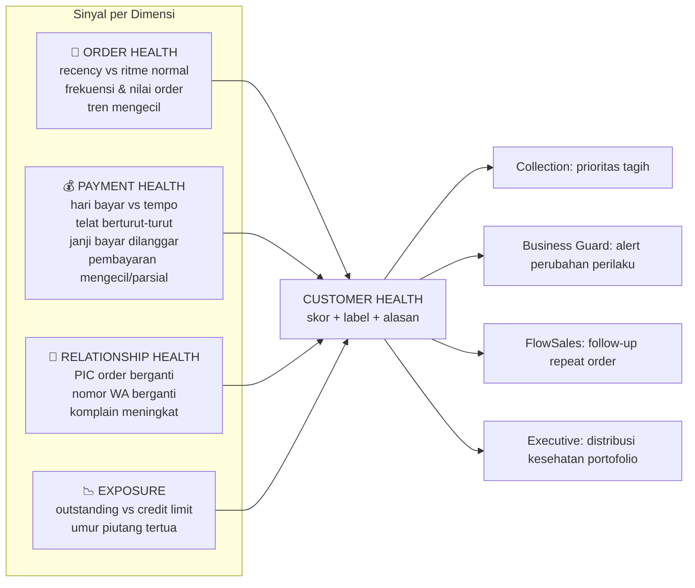
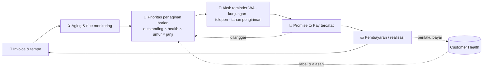
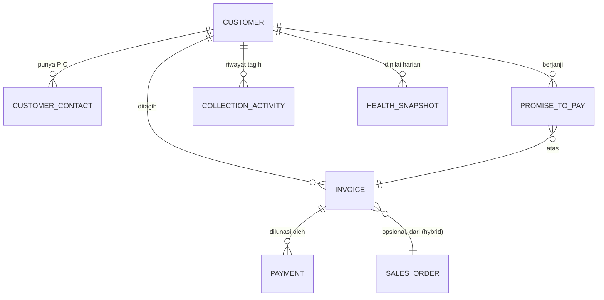

# 🔍 Phase 3A Discovery — Customer Health Intelligence & Collection Intelligence

| Field | Value |
|---|---|
| Dokumen | Business Discovery — Customer Health & Collection |
| Fase | Phase 3A (Discovery) — Constitution Driven Development |
| Acuan | AODP Product Constitution v1.1 (L12: Customer Health = insight layer; L13: Executive Intelligence = command center; L7: hybrid; L14: rule-based → pattern learning) |
| Status | Menunggu Product Review sebelum Phase 3B (Implementation) |
| Design Partner | Waluyo Distributor (L11) |
| Sifat | Business Architecture — bukan spesifikasi teknis, bukan schema |

> Posisi dalam framework konstitusi:
> **Customer Health Intelligence = INSIGHT layer** (membaca dan menilai) ·
> **Collection Intelligence = ACTION layer** (menagih dan mengendalikan).
> Keduanya dihubungkan oleh rantai Data → Pattern Learning → Insight → Decision → Action.

---

## 1. Business Discovery Document

### 1.1 Konteks Bisnis Design Partner

Distributor kelas Waluyo menjalankan pola bisnis yang umum di distribusi Indonesia:

- **Penjualan kredit (tempo) ke toko/outlet** adalah nadi bisnis — barang turun hari
  ini, uang kembali 2–6 minggu kemudian. Piutang adalah aset terbesar sekaligus
  risiko terbesar.
- **Kontrol piutang masih manual**: catatan tagihan di buku/Excel, nota fisik dibawa
  sales/penagih, status pembayaran hidup di kepala orang.
- **Sinyal kemacetan sudah dikenal owner secara naluri**, tapi tidak tersistem:
  customer lancar mulai "batuk-batuk", PIC order berganti dari suami ke istri,
  nilai order mengecil sebelum akhirnya macet, janji bayar mulai mundur.
- Kasus Rp550 juta membuktikan pola yang sama di sisi barang: **kerugian besar selalu
  didahului deviasi kecil yang tidak tertangkap**.

### 1.2 Masalah yang Diselesaikan (Jobs to be Done)

| Aktor | Job to be Done | Hari ini |
|---|---|---|
| **Owner** | "Saya ingin tahu piutang mana yang mulai berbahaya SEBELUM macet, bukan sesudahnya." | Tahu setelah 2–3 bulan nunggak |
| **Owner** | "Saya ingin tahu total uang saya di luar, dan berapa yang berisiko." | Hitung manual, jarang update |
| **Collection/Admin** | "Setiap pagi saya ingin tahu siapa yang harus ditagih duluan dan bawa konteks apa." | Berdasar ingatan & nota fisik |
| **Collection/Admin** | "Janji bayar customer harus tercatat dan ditagih ulang tepat waktu." | Dicatat di kertas/ingatan, sering lolos |
| **Sales** | "Saya perlu tahu customer saya yang mana yang order-nya menurun / berisiko, supaya bisa follow-up." | Tidak ada sinyal sistematis |

### 1.3 Kondisi Aset Saat Ini (yang bisa dimanfaatkan)

- ✅ Master `customers` (area, tipe, assigned sales) — perlu diperluas atribut kredit.
- ✅ `sales_orders` dengan status sampai `invoiced`/`paid` — sumber sinyal order.
- ✅ `sales_reports` — ritme aktivitas sales per area.
- ✅ Import pipeline CSV/Excel — jalur masuk data piutang existing (sesuai L7 hybrid).
- ✅ Automation engine + n8n — kanal aksi reminder WhatsApp.
- ✅ Executive dashboard + pola alert Business Guard.
- ❌ Belum ada: invoice, payment, promise to pay, aktivitas penagihan, health snapshot.

### 1.4 Pertanyaan Discovery untuk Pak Waluyo (wajib dijawab sebelum/di awal 3B)

Parameter operasional berikut **belum terdokumentasi** dan menentukan kalibrasi:

1. Berapa tempo standar? Satu tempo untuk semua atau beda per customer/tipe?
2. Berapa jumlah customer kredit aktif dan kisaran total outstanding?
3. Siapa yang menagih hari ini — collection khusus, admin, atau sales yang pegang area?
4. Bagaimana bentuk "invoice" sekarang (nota fisik? Excel? dari sistem lain?) dan
   bagaimana pembayaran diterima (transfer, tunai via sales, giro)?
5. Definisi "macet" versi Waluyo: lewat berapa hari / berapa kali janji bolos?
6. Apakah pembayaran parsial (cicil nota) lazim?
7. Apakah ada praktik "tukar nota / TT" (tanda terima dulu, tagih kemudian)?
8. Kanal reminder yang bisa diterima customer: WA langsung dari sistem, WA dari
   penagih, atau telepon?

---

## 2. Customer Health Framework (INSIGHT Layer — L12)

### 2.1 Prinsip

1. **Satu customer, satu kesehatan.** Health adalah pandangan menyeluruh per customer,
   bukan metrik terpisah-pisah di tiap modul.
2. **Baseline per entitas** (L14): normalitas customer A dihitung dari sejarah customer
   A — bukan rata-rata semua customer.
3. **Insight, bukan aksi.** Layer ini tidak menagih dan tidak mengirim apa pun; ia
   dikonsumsi oleh Collection, Business Guard, FlowSales, dan Executive Intelligence.
4. **Rule-based dulu, jujur** (AI Constitution #6): v1 memakai aturan deterministik
   yang bisa dijelaskan ke owner dalam satu kalimat; pattern learning menyusul
   setelah data Waluyo mengalir.

### 2.2 Empat Dimensi Kesehatan



### 2.3 Katalog Sinyal (v1 rule-based → v2 pattern learning)

| Sinyal | Rule v1 (deterministik, dapat dijelaskan) | Evolusi v2 (pattern) |
|---|---|---|
| Order melambat | hari sejak order terakhir > 1,5× median interval order customer itu | prediksi jendela order berikutnya |
| Order mengecil | rata-rata nilai 3 order terakhir < 70% baseline 6 bulan | deteksi tren + musiman |
| Bayar melambat | rata-rata hari-bayar 3 invoice terakhir > tempo + toleransi | pergeseran distribusi hari-bayar |
| Telat berulang | ≥2 invoice berturut-turut lewat jatuh tempo | probabilitas gagal bayar |
| Janji dilanggar | ≥1 promise to pay lewat tanggal tanpa pembayaran | pola janji vs realisasi |
| Over-exposure | outstanding > credit limit, atau invoice tertua > X hari | limit dinamis berbasis perilaku |
| PIC berganti | kontak pemesan ≠ kontak primer historis | anomali relasi |
| Nomor WA berganti | nomor baru dipakai untuk order/nego | anomali identitas |

### 2.4 Label Kesehatan (selaras label risiko Sprint 03)

| Label | Makna bisnis | Konsekuensi di layer Action |
|---|---|---|
| 🟢 **Aman** | Pola order & bayar sesuai baseline | Perlakuan normal |
| 🟡 **Perhatian** | ≥1 sinyal deviasi bermakna | Masuk radar collection & sales; reminder lebih awal |
| 🔴 **Risiko Tinggi** | Sinyal ganda / janji dilanggar / over-exposure | Prioritas tagih atas, rekomendasi tahan kredit, eskalasi owner |

Setiap label **wajib membawa alasan** (sinyal mana yang menyala) dan **rekomendasi**
— sesuai AI Constitution #3. Ambang (1,5×; 70%; toleransi hari) adalah **parameter
kalibrasi** yang akan divalidasi dengan data Waluyo, bukan konstanta produk.

### 2.5 Irama Perhitungan

- **Snapshot harian** per customer (batch) — cukup untuk irama keputusan distribusi;
  menghindari kompleksitas event-driven di Design Partner Edition (Minimize but
  Optimize).
- Snapshot menyimpan: skor per dimensi, label, sinyal aktif + alasannya, dan tren
  vs snapshot sebelumnya — sehingga Executive bisa bercerita "memburuk/membaik".

---

## 3. Collection Intelligence Framework (ACTION Layer)

### 3.1 Loop Inti Penagihan



### 3.2 Aging Framework

Bucket standar (dikalibrasi dengan tempo Waluyo — pertanyaan discovery #1):

**Belum jatuh tempo · 1–30 hari · 31–60 hari · 61–90 hari · >90 hari**

Prinsip: aging dihitung dari **jatuh tempo**, bukan tanggal invoice; pembayaran
parsial mengurangi outstanding invoice tertua dulu (kecuali dialokasikan manual —
mengikuti praktik lapangan, pertanyaan discovery #6).

### 3.3 Prioritas Penagihan (Decision)

Daftar kerja harian collection diurutkan oleh skor prioritas gabungan:

> **Prioritas = f(nilai outstanding, label health, umur tunggakan, janji dilanggar,
> status komunikasi terakhir)**

Bentuk output untuk penagih — bukan angka mentah, tapi kartu kerja:
*"Tagih Toko Sumber Rejeki hari ini — outstanding Rp12,4 jt, invoice tertua 47 hari,
janji bayar Selasa lalu tidak ditepati, order juga menurun 40%. Rekomendasi: kunjungi
langsung, jangan hanya WA."*

### 3.4 Promise to Pay — Siklus Hidup

`Dibuat (tanggal + nominal + kanal) → Ditepati / Ditepati sebagian / Dilanggar`

- Janji dilanggar otomatis menaikkan prioritas + memburukkan Payment Health.
- Janji jatuh tempo **hari ini** selalu muncul di daftar kerja pagi.

### 3.5 Tangga Reminder (Action)

| Tahap | Waktu | Kanal | Pelaksana |
|---|---|---|---|
| Pengingat sopan | H-3 sebelum jatuh tempo | Template WA | Sistem (via automation) |
| Jatuh tempo | H0 | Template WA | Sistem/penagih |
| Tindak lanjut | H+3 | WA/telepon oleh penagih | Manusia, dibekali konteks |
| Eskalasi | H+7 atau janji dilanggar | Daftar eskalasi owner + rekomendasi | Owner memutuskan |

Sesuai AI Constitution #1: sistem **merekomendasikan dan menyiapkan** (draft pesan,
konteks, prioritas); keputusan bermuatan relasi (menahan kredit, kunjungan, penagihan
keras) tetap di tangan manusia. Otomasi penuh hanya untuk pengingat rutin yang
disetujui owner di konfigurasi.

---

## 4. Domain Model (Konseptual)



| Entitas (konsep) | Peran bisnis | Catatan |
|---|---|---|
| **Customer** (ada) | + atribut kredit: limit, tempo (hari), status kredit | Perluasan, bukan entitas baru |
| **CustomerContact** (baru) | PIC per customer + jejak perubahan | Bahan sinyal "PIC berganti" |
| **Invoice** (baru) | Tagihan: nomor, tanggal, jatuh tempo, nilai, status | Hybrid: input manual, import CSV, atau lahir dari sales_order (L7) |
| **Payment** (baru) | Pembayaran per invoice: tanggal, nilai, metode | Mendukung parsial |
| **PromiseToPay** (baru) | Janji bayar: tanggal janji, nominal, status ditepati/dilanggar | Sinyal kunci health |
| **CollectionActivity** (baru) | Log aksi: reminder/telepon/kunjungan + hasil | Konteks kerja penagih |
| **HealthSnapshot** (baru) | Hasil harian insight layer: skor, label, sinyal, tren | Dikonsumsi 4 konsumen (L12) |

**Sengaja tidak diusulkan (Minimize but Optimize):** entitas `CollectionCase`
tersendiri — di skala Waluyo, "kasus" cukup direpresentasikan oleh kombinasi label
Risiko Tinggi + aktivitas penagihan; entitas kasus formal ditinjau ulang bila
volume design partner membuktikannya perlu (lihat Open Discussion OD-3A-2).

---

## 5. Executive Intelligence Integration (L13)

Kontrak kontribusi ke command center — setiap item membawa (metrik, narasi, rekomendasi, severity):

| Kontribusi | Bentuk | Contoh |
|---|---|---|
| **Komponen Business Health Score** | Skor kesehatan piutang portofolio | "Kesehatan piutang 72/100, turun 5 poin minggu ini" |
| **Kartu dashboard Collection** | Outstanding total, overdue, distribusi label | "Rp187 jt di luar; Rp43 jt lewat tempo; 6 customer 🔴" |
| **Seksi WhatsApp report harian** | 3 hal terpenting hari ini | "1) PT X janji bayar hari ini Rp15 jt. 2) Toko Y janji bolos ke-2 — rekomendasi tahan kredit. 3) 4 customer turun ke Perhatian." |
| **Alert (via jalur Business Guard)** | Perubahan label ke 🔴 / janji dilanggar / over-limit | Severity high + alasan + rekomendasi — tidak bisa dihapus sales (L9) |
| **Umpan ke FlowSales** | Customer sehat yang telat order | Masuk daftar follow-up sales |

---

## 6. Architecture Proposal (Business Architecture)

```mermaid
flowchart TB
    subgraph DATA["DATA"]
        A1[Input manual invoice/payment]
        A2[Import CSV dari catatan existing]
        A3[sales_orders status invoiced/paid]
        A4[WA & kontak (fase berikutnya)]
    end
    subgraph INSIGHT["CUSTOMER HEALTH (insight layer — lib terpisah, tanpa UI sendiri)"]
        B1[Snapshot harian per customer]
        B2[Katalog sinyal rule-based v1]
    end
    subgraph ACTION["COLLECTION (modul operasional — UI + aksi)"]
        C1[Aging & due monitoring]
        C2[Daftar prioritas harian]
        C3[Promise to Pay]
        C4[Reminder ladder → automation/n8n]
    end
    subgraph EXEC["EXECUTIVE INTELLIGENCE (command center)"]
        D1[Health score · dashboard · WA report · alert]
    end
    DATA --> INSIGHT --> ACTION --> EXEC
    INSIGHT --> EXEC
    ACTION -.pembayaran & aktivitas.-> DATA
```

Keputusan arsitektur bisnis yang diusulkan (tunduk review):

1. **Customer Health = pustaka insight tanpa UI sendiri** — konsisten L12; wajahnya
   menumpang di Collection, FlowSales, Business Guard, dan Executive.
2. **Collection = modul operasional dengan UI** — menu `Collection` yang sudah ada
   placeholder-nya.
3. **Batch harian dulu, bukan event-driven** — irama keputusan distribusi harian;
   kompleksitas realtime tidak dibayar sebelum dibutuhkan.
4. **Hybrid data masuk 3 pintu** (manual, import, dari sales_order) — kelanjutan
   langsung L7; distributor tidak dipaksa rapi dulu untuk terlindungi.
5. **Reminder memakai automation engine existing** — tidak membangun kanal baru.

---

## 7. Entity Draft (Konsep — bukan migration)

Rincian atribut konseptual per entitas §4 (nama final ditetapkan di Phase 3B):

- **customers** *(perluasan)*: `credit_limit`, `payment_terms_days`, `credit_status`
- **customer_contacts**: nama, telepon/WA, peran (pemilik/istri/karyawan), `is_primary`, jejak waktu
- **invoices**: nomor, customer, salesperson, tanggal, jatuh tempo, nilai, diskon, status (open/partial/paid/void), sumber (manual/import/order), ref opsional ke sales_order
- **payments**: invoice, tanggal, nilai, metode (transfer/tunai/giro), catatan, penerima
- **promises_to_pay**: customer, invoice (ops.), tanggal janji, nominal, kanal, status (pending/kept/partial/broken), dicatat oleh
- **collection_activities**: customer, invoice (ops.), jenis (reminder WA/telepon/kunjungan), hasil, catatan, pelaksana, waktu
- **customer_health_snapshots**: customer, tanggal, skor per dimensi, label (Aman/Perhatian/Risiko Tinggi), sinyal aktif + alasan (terstruktur), tren

Semua entitas: `company_id` + RLS (konstitusi §11), akses collection data mengikuti
Owner First (sales melihat terbatas pada customer-nya — final RBAC di 3B).

---

## 8. Sprint Recommendation — Phase 3B

| Sprint | Fokus | Isi | Acceptance (bisnis) |
|---|---|---|---|
| **3B-1 — Data Piutang** | DATA | Perluasan customer (kredit), invoice + payment (manual + import CSV + dari sales_order), aging & due monitoring, halaman Collection dasar | Owner melihat outstanding & aging riil customer Waluyo hasil import catatan existing |
| **3B-2 — Health & Prioritas** | INSIGHT + DECISION | Health snapshot harian rule-based v1, label + alasan, daftar prioritas penagihan, promise to pay + activity log | Penagih memulai pagi dari daftar prioritas sistem; setiap label punya alasan; janji bolos otomatis naik prioritas |
| **3B-3 — Aksi & Eksekutif** | ACTION + EXEC | Template reminder WA + tangga reminder via automation, seksi collection di dashboard & WA report owner, alert perubahan label via jalur Business Guard | Owner menerima ringkasan collection harian + eskalasi; minimal 3 alert nyata dihasilkan dari data Waluyo |

Checkpoint design partner: jawaban 8 pertanyaan discovery (§1.4) dikunci **sebelum
3B-1 selesai**, kalibrasi ambang sinyal (§2.3) ditinjau bersama Pak Waluyo **di akhir
3B-2**.

---

## Open Discussion (menunggu keputusan Founder — tidak diputuskan sendiri)

| # | Topik | Konteks |
|---|---|---|
| OD-3A-1 | **Siapa pelaksana penagihan di Waluyo** — collection khusus, admin, atau sales area? Menentukan RBAC daftar prioritas & apakah role `collection` perlu diaktifkan terpisah dari `finance` yang sudah ada. |
| OD-3A-2 | **Entitas CollectionCase** — PRD awal mencantumkannya; proposal discovery ini menundanya (Minimize but Optimize) dan merepresentasikan "kasus" via label + aktivitas. Perlu persetujuan bahwa penundaan ini tidak melanggar scope PRD. |
| OD-3A-3 | **Invoice lahir otomatis dari sales_order berstatus `invoiced`** — konsisten semangat hybrid L7, tapi PRD tidak eksplisit. Perlu konfirmasi + aturan agar tidak dobel dengan input manual/import. |
| OD-3A-4 | **Batas otomasi reminder** — apakah reminder H-3/H0 boleh terkirim penuh otomatis ke customer, atau semua pesan keluar harus melalui persetujuan manusia dulu di Design Partner Edition? Menyentuh AI Constitution #1 dan kenyamanan relasi customer Waluyo. |

---

*Dokumen ini murni business architecture. Tidak ada kode, migration, schema, atau UI
yang dibuat pada fase ini. Implementasi menunggu Product Review.*
