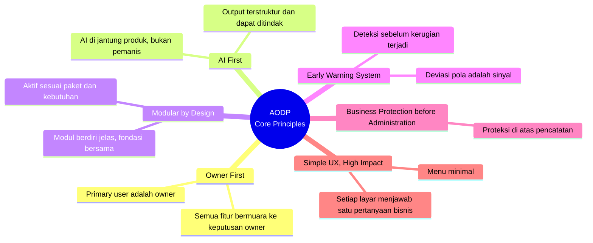
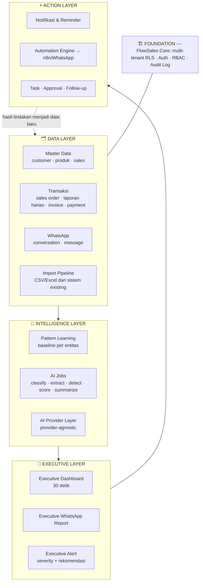
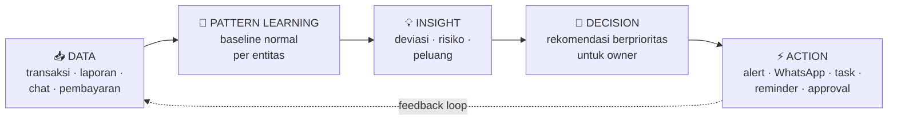
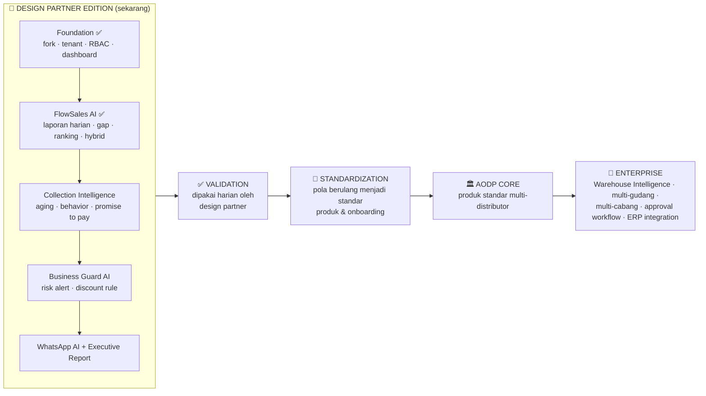

# 📘 AODP Product Constitution

| Field | Value |
|---|---|
| Dokumen | AODP Product Constitution |
| Versi | 1.2 |
| Status | **Design Partner Edition** — bukan AODP Core |
| Tanggal | 2026-07-07 (v1.1: resolusi Open Discussion OD1, OD2, OD3, OD5 oleh Founder) · 2026-07-16 (v1.2: Discovery Waluyo ditetapkan COMPLETE, AODP Waluyo Living Knowledge Pack v1.0 dipublikasikan, vertical slice Sales Order → Delivery Verification → Invoice → Collection → Owner Alert dikunci — lihat L15, L16, Appendix C) |
| Pemilik | Founder (Hendro) |
| Peran penyusun | ChatGPT (CTO + Product Manager) · Claude Code (Senior Programmer) |
| Sifat | Konstitusi produk — bukan PRD, bukan Technical Specification |

> Dokumen ini adalah referensi tertinggi seluruh pengembangan AODP: produk, arsitektur,
> coding, UX, AI, roadmap, pricing, dan implementasi. Bila dokumen lain bertentangan
> dengan dokumen ini, dokumen ini yang berlaku. Perubahan terhadap dokumen ini hanya
> sah melalui keputusan eksplisit Founder.

---

## 1. Executive Summary

**AI Operating Distributor Platform (AODP)** adalah AI Operating System untuk owner
distributor kecil-menengah. AODP bukan ERP, bukan POS, bukan CRM. AODP adalah lapisan
kecerdasan yang menjaga bisnis distributor tetap **aman**: sales terkontrol, piutang
terpantau, diskon tidak bocor, order WhatsApp tidak hilang, dan keputusan harian bisa
diambil dalam 30 detik.

Produk ini lahir dari kasus nyata design partner resmi AODP — **Waluyo Distributor**:
kerugian **Rp550 juta** akibat
mismatch antara PO, pengiriman, dan barang yang benar-benar diterima customer —
kerugian yang tidak terdeteksi karena tidak ada early warning system.

Filosofi inti AODP adalah **Minimize but Optimize**: sedikit fitur, dampak bisnis
nyata. Setiap modul wajib mengikuti rantai **Data → Pattern Learning → Insight →
Decision → Action** dan bermuara pada satu pengguna utama: **owner**.

AODP saat ini berada pada tahap **Design Partner Edition** — dibangun dan divalidasi
bersama distributor nyata, di atas fondasi teknis FlowSales Core yang telah teruji
(multi-tenant, RLS, RBAC, AI provider layer). Jalur menuju produk standar mengikuti:

**Experience → Validation → Standardization → AODP Core**

Model bisnis: setup fee sesuai skala distributor (Rp5–20 juta) + langganan bulanan
(Rp1,99 juta / Rp2,99 juta / Enterprise custom). Harga mengikuti skala bisnis, bukan
jumlah fitur.

Visi jangka panjang: **The AI Chief Operating Officer for Every Distributor.**

---

## 2. Product Vision

Setiap owner distributor — sekecil apa pun — memiliki "Chief Operating Officer"
berbasis AI yang mengawasi bisnisnya 24 jam: membaca data, mengenali pola, mendeteksi
risiko lebih awal, dan merekomendasikan tindakan yang jelas.

## 3. Product Mission

Membantu owner distributor:

1. **Tetap aman** — fraud, kebocoran diskon, dan kehilangan barang terdeteksi dini.
2. **Mengontrol sales** — tahu sales bekerja atau tidak, target tercapai atau tidak.
3. **Mengendalikan piutang** — tidak ada customer yang tiba-tiba macet.
4. **Tidak kehilangan order** — order dan komplain dari WhatsApp tertangkap sistem.
5. **Memutuskan cepat** — kondisi bisnis terbaca dalam 30 detik, dengan rekomendasi.

## 4. North Star

> **Owner distributor dapat mengetahui kondisi bisnisnya dalam 30 detik dan mendapat
> rekomendasi tindakan yang jelas.**

Semua keputusan produk diuji terhadap kalimat ini. Fitur yang tidak memperpendek
jarak antara *kondisi bisnis* dan *tindakan owner* tidak dibangun.

---

## 5. Product Philosophy

### Minimize but Optimize

- Tidak membuat ERP penuh dengan ratusan menu.
- Setiap fitur harus punya dampak bisnis nyata yang bisa disebutkan dalam satu kalimat.
- Dashboard harus dipahami owner tanpa training panjang.
- AI harus membantu mengambil keputusan — bukan sekadar menampilkan data.

### Business Protection before Administration

AODP memprioritaskan **melindungi uang owner** di atas kerapihan administrasi.
Pencatatan hanyalah sarana; proteksi adalah tujuan. Inilah pembeda AODP dari ERP:
ERP dibangun untuk mencatat, AODP dibangun untuk menjaga.

---

## 6. Core Principles

1. **Owner First** — pengguna utama adalah owner; admin, salesman, collection, dan
   gudang adalah pengguna pendukung yang memberi data untuk keputusan owner.
2. **AI First** — kecerdasan bukan fitur tambahan; setiap modul memiliki AI jobs
   dengan output terstruktur.
3. **Modular by Design** — modul dapat diaktifkan bertahap sesuai paket, di atas
   satu fondasi bersama (auth, tenant, RBAC, data, AI layer).
4. **Early Warning System** — sistem dinilai dari seberapa dini ia memperingatkan,
   bukan seberapa lengkap ia mencatat.
5. **Business Protection before Administration** — lihat §5.
6. **Simple UX, High Impact** — menu minimal (7 menu utama); satu layar menjawab
   satu pertanyaan bisnis.

---

## 7. AI Constitution

Aturan yang mengikat seluruh penggunaan AI di AODP:

1. **AI merekomendasikan, owner memutuskan.** AI tidak pernah mengeksekusi keputusan
   bisnis final (menolak order, memutus kredit, memecat sales) tanpa persetujuan manusia.
2. **Setiap output AI terstruktur.** AI jobs mengembalikan JSON terstruktur yang bisa
   diproses sistem — bukan teks bebas.
3. **Setiap alert punya alasan dan rekomendasi.** Format alert wajib: judul, severity,
   entitas terkait, alasan, rekomendasi tindakan, status.
4. **Provider-agnostic.** Business logic tidak pernah memanggil vendor AI langsung;
   semua melalui AI Provider Layer (Anthropic/OpenAI/lainnya dapat dipertukarkan).
5. **AI tidak bisa dibungkam oleh yang diawasi.** Alert Business Guard tidak dapat
   dihapus oleh role sales; integritas early warning dilindungi RBAC.
6. **Bertahap dan jujur.** Selama Design Partner Edition, sebagian "kecerdasan" berupa
   rule/kalkulasi deterministik berlabel jelas — di-upgrade ke AI penuh setelah pola
   penggunaan tervalidasi. Tidak ada AI-washing.

---

## 8. Executive First Architecture

Seluruh arsitektur bermuara ke satu titik: **lapisan eksekutif owner**.

- **Executive Dashboard** — kondisi bisnis dalam 30 detik (health score, pencapaian
  sales, risiko collection, alert terbuka, order WhatsApp).
- **Executive WhatsApp Report** — owner tidak harus membuka aplikasi; laporan harian
  datang ke WhatsApp-nya.
- **Executive Alert** — risiko berat menemui owner, bukan menunggu ditemukan.

Konsekuensi arsitektural: setiap modul **wajib** menyumbang ringkasan ke lapisan
eksekutif. Modul yang tidak bisa diringkas untuk owner belum selesai dibangun.

---

## 9. Pattern Learning Engine Philosophy

Kerugian besar distributor jarang datang tiba-tiba — ia selalu didahului perubahan
pola: customer lancar mulai "batuk-batuk", PIC order berganti dari suami ke istri,
nilai order mengecil sebelum macet, diskon melebar perlahan ke banyak sales.

Prinsip Pattern Learning Engine:

1. **Normalitas dipelajari per entitas.** Pola normal customer A berbeda dari customer
   B; baseline dibentuk dari data historis masing-masing, bukan angka rata-rata industri.
2. **Deviasi adalah sinyal.** Perubahan perilaku (pembayaran, order, diskon, PIC,
   nomor WhatsApp) adalah bahan baku early warning — inilah sumber AI jobs `detect*`
   (payment behavior change, repeat order risk, discount anomaly, behavior change).
3. **Bertumbuh bersama data.** Design Partner Edition memulai dengan aturan dan
   kalkulasi eksplisit; semakin banyak data nyata mengalir, deteksi berbasis pola
   menggantikan aturan statis. Rantai Experience → Validation → Standardization
   berlaku juga untuk kecerdasan.

---

## 10. Owner First Principle

- Persona utama seluruh keputusan UX dan produk: **owner distributor**.
- Pengguna sekunder (admin sales, salesman, collection, gudang) dilayani sejauh
  perannya memberi data dan menjalankan tindakan untuk owner.
- Informasi sensitif (aturan diskon, alert risiko, skor risiko sales) hanya untuk
  owner/manajemen — dilindungi RBAC dan RLS.
- Bukti implementasi yang sudah terkunci: sales hanya melihat dan melaporkan datanya
  sendiri; owner melihat semuanya.

---

## 11. AI Operating Distributor Platform Architecture

Keputusan arsitektur yang terkunci:

| # | Keputusan | Status |
|---|---|---|
| 1 | AODP dibangun di atas **fork FlowSalesAI Beta** (FlowSales Core sebagai fondasi bersama); FlowSalesAI beta berjalan terpisah untuk PT Viona | 🔒 |
| 2 | Multi-tenant dengan isolasi **RLS** di semua tabel; entitas tenant bernama **`companies`** (bukan `organizations`) | 🔒 |
| 3 | Salesperson = **`users` + role `sales`** — tanpa tabel terpisah di MVP | 🔒 |
| 4 | **Model hybrid**: laporan harian sales tetap bisa diinput manual; bila data sales order tersedia, sistem meng-agregasi dan membandingkan otomatis. Operasi lapangan distributor sering belum rapi — input manual tidak boleh diwajibkan hilang | 🔒 |
| 5 | AI Provider Layer provider-agnostic; business logic tidak memanggil vendor langsung | 🔒 |
| 6 | Stack: Next.js App Router · TypeScript · Tailwind · Supabase PostgreSQL · n8n untuk kanal aksi | 🔒 |
| 7 | Warehouse Intelligence hanya placeholder di MVP | 🔒 |

---

## 12. Module Definition

### Modul Operasional

| Modul | Peran | Status |
|---|---|---|
| **WhatsApp AI** | Front office — menangkap order, intent, komplain, missed call, repeat order reminder dari WhatsApp | MVP |
| **FlowSales AI** | Kontrol performa sales — target vs pencapaian OA & omzet, gap, ranking, ringkasan AI | MVP · ✅ terbangun |
| **Collection Intelligence** | Pengendalian piutang — aging AR, due date, payment behavior, promise to pay, prioritas penagihan | MVP · berikutnya |
| **Business Guard AI** | **Hero module** — early warning fraud: anomali diskon, perubahan perilaku, quantity mismatch, skor risiko transaksi & sales | MVP |
| **Warehouse Intelligence** | Kontrol fisik barang — picking, loading, delivery confirmation, deteksi kehilangan (menjawab kasus Rp550 juta) | Roadmap / Enterprise |

### Lapisan Intelligence (bukan modul operasional) 🔒

| Lapisan | Peran |
|---|---|
| **Customer Health Intelligence** | Domain/layer insight kesehatan customer lintas sinyal — pola order, perilaku pembayaran, perubahan PIC. **Bukan modul operasional terpisah**; output-nya dikonsumsi oleh Collection, Business Guard, FlowSales, dan Executive Intelligence. |
| **Executive Intelligence** | **Lapisan muara / command center** — semua modul mengirim insight ke sana: health score, executive report, ringkasan lintas modul ke owner (§13). |

Setiap modul wajib mendefinisikan: use case bisnis, AI jobs dengan output terstruktur,
kontribusi ke Executive Layer, dan batas RBAC-nya. Spesifikasi rinci per modul hidup
di `docs/product/modules/`.

---

## 13. Executive Intelligence Philosophy

Executive Intelligence adalah **lapisan muara / command center** (🔒 terkunci — bukan
modul biasa) yang memaksa semua modul berbicara dalam satu bahasa: bahasa keputusan
owner.

- **Satu skor, satu cerita.** Business Health Score merangkum kondisi lintas modul;
  narasi eksekutif menjelaskan *mengapa* dan *apa yang harus dilakukan*.
- **Datang ke owner.** Laporan harian dikirim ke WhatsApp owner — bukan menunggu
  owner login.
- **Prioritas, bukan volume.** Owner tidak butuh 100 notifikasi; ia butuh 3 hal
  terpenting hari ini dengan rekomendasi jelas (format: URGENT / HIGH / MEDIUM).

---

## 14. AI Decision Framework

Kontrak untuk setiap fitur: **fitur yang berhenti di "menampilkan data" belum
selesai.** Contoh penerapan rantai penuh:

| Modul | Data | Pattern | Insight | Decision | Action |
|---|---|---|---|---|---|
| Collection | riwayat pembayaran | pola bayar normal customer | "PT X mulai telat 2× berturut-turut" | prioritas tagih + batasi kredit | reminder WA + task collection |
| Business Guard | diskon per transaksi | diskon wajar per produk/area | "diskon sales B melebar 3 minggu" | investigasi sales B | alert owner severity high |
| FlowSales | laporan harian + order | ritme omzet per sales | "gap Rp500rb, sisa 18 hari" | butuh ±Rp28rb/hari | ringkasan + coaching |
| WhatsApp AI | chat masuk | ritme order per customer | "customer C biasa order, minggu ini tidak" | follow-up sebelum hilang | reminder ke sales |

---

## 15. Product Roadmap

Prinsip roadmap:

- Urutan modul mengikuti **nilai proteksi bagi owner**, bukan kemudahan teknis.
- Fitur naik kelas dari Design Partner Edition ke AODP Core hanya setelah
  **tervalidasi oleh penggunaan nyata** — bukan asumsi.
- Warehouse Intelligence (jawaban penuh kasus Rp550 juta) sengaja ditempatkan setelah
  fondasi data & kepercayaan terbentuk.

---

## 16. Pricing Philosophy

> **Bayar sesuai skala bisnis, bukan jumlah fitur.** 🔒

Tiga komponen (terkunci di Pricing Strategy Lock v1.0):

1. **Implementation Fee** — *AI Distributor Transformation Program*: business mapping,
   SOP mapping, import data, konfigurasi AI, training, go-live, pendampingan.
   Mikro Rp5 jt · Kecil Rp10 jt · Menengah Rp20 jt · Enterprise custom.
2. **Monthly Subscription** —
   **Owner Protection Lite** Rp1.990.000/bln (1–5 sales: WhatsApp AI, FlowSales AI,
   Executive Dashboard & WhatsApp Report) ·
   **Owner Protection** Rp2.990.000/bln (5–20 sales: + Collection Intelligence,
   Business Guard AI) ·
   **Enterprise** custom (semua modul + Warehouse Intelligence, multi-gudang,
   multi-cabang, approval workflow, ERP integration, custom AI).
3. **Custom Development / Continuous Improvement.**

Kapasitas internal diukur per driver modul: percakapan WhatsApp, jumlah sales,
customer kredit aktif, volume transaksi, volume operasi gudang.

---

## 17. Design Partner Philosophy

- AODP dibangun **bersama distributor nyata**, bukan dari asumsi ruang rapat.
- **Design partner resmi AODP: Waluyo Distributor** 🔒. PT Viona Multi Global adalah
  project/lesson sebelumnya (FlowSalesAI beta) — bukan design partner AODP.
  "Surabraja" bukan design partner AODP dan tidak termasuk scope discovery (L15).
- Design partner memberi: kasus nyata (kerugian Rp550 juta), proses bisnis nyata,
  data nyata, dan validasi harian. AODP memberi: proteksi bisnis dan pengaruh
  langsung terhadap arah produk.
- Discovery Waluyo (Customer Health, Collection, Delivery Verification, Business
  Guard) ditetapkan **COMPLETE** oleh Founder (2026-07-16). Temuan tervalidasi
  hasil discovery dipublikasikan sebagai **AODP Waluyo Living Knowledge Pack
  v1.0** (`docs/knowledge/packs/waluyo/AODP_WALUYO_LIVING_KNOWLEDGE_PACK_v1.0.md`,
  Pack ID `AODP-WALUYO-CORE-001`) — lihat Appendix C untuk registry Living
  Knowledge Pack yang berlaku, dan L15/L16 untuk keputusan terkunci turunannya.
- Rantai kedewasaan produk: **Experience → Validation → Standardization → AODP Core.**
  Fitur yang belum melewati rantai ini berstatus Design Partner Edition.
- Implementasi di partner dijalankan sebagai *AI Distributor Transformation Program* —
  transformasi proses, bukan sekadar instalasi software.

---

## 18. Standalone vs AI Layer Strategy

AODP menjalankan strategi dua jalur yang sudah tersirat dalam keputusan terkunci:

1. **Standalone-first (sekarang).** AODP berdiri sendiri dengan input manual yang
   ramah operasi lapangan + import pipeline (CSV/Excel) dari sistem existing.
   Distributor tidak dipaksa mengganti sistem lama untuk mulai terlindungi.
2. **AI Layer (Enterprise).** Bagi distributor yang telah memiliki ERP, AODP hadir
   sebagai lapisan kecerdasan di atasnya melalui integrasi ERP (paket Enterprise) —
   ERP tetap mencatat, AODP menjaga dan memutuskan.

Model hybrid FlowSales (input manual + agregasi otomatis bila data order tersedia)
adalah wujud pertama strategi ini dan menjadi pola bagi modul-modul berikutnya.

---

## 19. Product Boundaries

### AODP MELAKUKAN

✅ Executive dashboard & WhatsApp report untuk owner ·
✅ Kontrol performa sales harian ·
✅ Early warning piutang & perilaku customer ·
✅ Deteksi fraud, anomali diskon, transaksi berisiko ·
✅ Penangkapan order/komplain WhatsApp ·
✅ Master data secukupnya (customer, produk, sales) ·
✅ Import data dari sistem existing ·
✅ (Enterprise) kontrol pergerakan fisik barang & integrasi ERP

### AODP TIDAK MELAKUKAN

❌ Accounting system penuh / finance reconciliation ·
❌ POS ·
❌ CRM umum ·
❌ HR / payroll ·
❌ Warehouse management kompleks di MVP ·
❌ Aplikasi dengan ratusan menu ·
❌ Keputusan bisnis final tanpa manusia (lihat AI Constitution) ·
❌ Fitur tanpa dampak bisnis yang bisa disebut dalam satu kalimat

---

## 20. Future Vision

> **The AI Chief Operating Officer for Every Distributor.**

Arah jangka panjang: dari *early warning* menjadi *operating intelligence* — AI yang
memahami ritme bisnis setiap distributor, mengawasi operasi harian dari order sampai
barang diterima customer, dan mendampingi owner mengambil keputusan seperti seorang
COO berpengalaman: selalu hadir, tidak pernah lelah, dan berpihak pada owner.

Jalan ke sana tetap tunduk pada konstitusi ini: Minimize but Optimize, Owner First,
dan Experience → Validation → Standardization → AODP Core.

---

## Appendix A — Locked Decisions Register

| # | Keputusan | Sumber |
|---|---|---|
| L1 | Nama produk: AI Operating Distributor Platform (AODP) | Product Constitution awal |
| L2 | North Star 30 detik + rekomendasi jelas | Product Constitution awal |
| L3 | Pricing 3 komponen + harga paket | Pricing Strategy Lock v1.0 |
| L4 | Fork FlowSalesAI → AODP; beta PT Viona berjalan terpisah; migrasi Viona hanya setelah AODP stabil | Phase 0, 2026-07-07 |
| L5 | Entitas tenant `companies`; docs mengikuti schema | Phase 0 |
| L6 | Salesperson = `users` + role `sales` | Phase 0 |
| L7 | Model hybrid sales report ↔ sales order | Phase 0 |
| L8 | Warehouse Intelligence placeholder di MVP | Claude Code Instructions |
| L9 | Alert Business Guard tidak bisa dihapus role sales | Tech Architecture |
| L10 | Role split: ChatGPT = CTO/PM, Claude Code = Senior Programmer; tidak mengubah arah produk tanpa approval Founder | Claude Code Instructions |
| L11 | Design partner resmi AODP: **Waluyo Distributor**; PT Viona = project/lesson sebelumnya, bukan design partner AODP | Founder, v1.1 (eks-OD1) |
| L12 | **Customer Health Intelligence** = domain/layer insight, bukan modul operasional terpisah; output dikonsumsi Collection, Business Guard, FlowSales, Executive Intelligence | Founder, v1.1 (eks-OD2) |
| L13 | **Executive Intelligence** = lapisan muara / command center, bukan modul biasa; semua modul mengirim insight ke sana | Founder, v1.1 (eks-OD3) |
| L14 | **Pattern Learning Engine**: filosofi terkunci (§9); spesifikasi teknis disusun setelah data nyata Waluyo Distributor berjalan | Founder, v1.1 (eks-OD5) |
| L15 | Discovery Waluyo (Customer Health/Collection/Delivery Verification/Business Guard) **COMPLETE**; hasil tervalidasi dipublikasikan sebagai **AODP Waluyo Living Knowledge Pack v1.0** (Pack ID `AODP-WALUYO-CORE-001`, lihat Appendix C). "Surabraja" **bukan** design partner AODP dan **tidak termasuk** scope discovery — tidak boleh dipakai sebagai sumber discovery kecuali Founder menetapkannya lewat proses discovery terpisah di masa depan. PT Viona Multi Global tetap bukan design partner AODP (menegaskan ulang L11) | Founder, v1.2, 2026-07-16 |
| L16 | **Vertical slice resmi AODP**: `Sales Order → Delivery Verification → Invoice → Collection → Owner Alert`. Ini urutan implementasi yang tidak boleh dipecah — workflow/modul lain (Business Guard, WhatsApp AI penuh, dst.) tidak dibuka sebagai jalur implementasi terpisah sebelum vertical slice ini selesai end-to-end. Telegram Sales Order Entry (tahap 1) sudah terbangun; Delivery Verification (tahap 2) adalah target implementasi berikutnya — lihat `docs/product/delivery-verification/AODP_DELIVERY_VERIFICATION_IMPLEMENTATION_GATE.md` | Founder, v1.2, 2026-07-16, sumber: AODP Waluyo Living Knowledge Pack v1.0 §4 |

## Appendix B — Open Discussions

Hal-hal berikut **belum diputuskan** dan tidak boleh dianggap keputusan hanya karena
tercantum di dokumen ini:

| # | Topik | Konteks |
|---|---|---|
| OD4 | **Supabase cloud production.** Limit free plan (2 project aktif) menahan pembuatan project cloud AODP. Keputusan Founder (v1.1): pending — pengembangan lanjut di Supabase lokal sampai project cloud AODP disiapkan Founder. |

*Riwayat: OD1, OD2, OD3, dan OD5 diputuskan Founder pada v1.1 dan dipindahkan ke
Locked Decisions Register sebagai L11–L14.*

## Appendix C — Living Knowledge Packs Register

Registry Living Knowledge Pack yang **berlaku** (published, locked) untuk AODP.
Pack baru (design partner lain, atau versi baru dari pack yang sudah ada)
ditambahkan sebagai baris baru di sini — bukan menggantikan baris lama secara
diam-diam, mengikuti siklus governance di §7 pack masing-masing
(`Observed → Candidate → Reviewed → Published → Superseded/Retired`).

| Pack ID | Versi | Design Partner | Status | Path | Effective Date |
|---|---|---|---|---|---|
| `AODP-WALUYO-CORE-001` | 1.0.0 | Waluyo Distributor (L11) | `PUBLISHED — LOCKED` | `docs/knowledge/packs/waluyo/AODP_WALUYO_LIVING_KNOWLEDGE_PACK_v1.0.md` | 2026-07-15 |

Dokumen audit terkait: `docs/audits/AODP_LIVING_KNOWLEDGE_AUDIT_CORRECTED_2026-07-15.md`.
Mapping temuan pack ini terhadap Business Interview Guide asli (K-01–K-31) ada
di `docs/product/discovery/PHASE_3A_PRODUCT_REVIEW_CALIBRATION.md` §2.

---

*Dokumen ini mengkonsolidasikan: `docs/product/00_PRODUCT_CONSTITUTION.md`, `docs/product/01_PRD.md`,
`docs/architecture/02_TECH_ARCHITECTURE.md`, `docs/product/04_PRICING_STRATEGY_LOCK.md`, `docs/product/modules/*`,
`docs/development/sprints/*`, `docs/development/CLAUDE_CODE_INSTRUCTIONS.md`, serta keputusan
Phase 0–2.5 (2026-07-07). Untuk scope rinci per rilis, lihat PRD; untuk arsitektur
teknis, lihat Tech Architecture. Untuk pengetahuan bisnis design-partner yang
terkunci, lihat Appendix C (Living Knowledge Packs Register) dan
`docs/knowledge/packs/`.*
