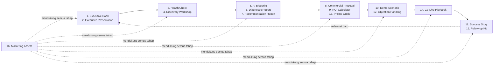

# 📚 AODP Executive Sales Kit

| Field | Value |
|---|---|
| Produk | AI Operating Distributor Platform (AODP) |
| Sifat | Materi komersial & consulting toolkit — bukan dokumen produk/teknis |
| Acuan isi | AODP Product Constitution v1.1 (positioning, pricing, filosofi, modul) |
| Gaya | Premium consulting (McKinsey/Deloitte/BCG framing, Stripe/Linear/Apple visual restraint) |
| Bahasa | Indonesia bisnis, tanpa hype pemasaran |

> Kit ini dipakai tim sales/consulting AODP untuk menjual **transformasi**, bukan
> software. Setiap dokumen menjawab satu momen dalam perjalanan calon Design
> Partner: dari perkenalan sampai go-live dan referensi. Semua pesan tunduk pada
> kerangka **Data → Insight → Decision → Action** dan filosofi **Minimize but
> Optimize / Owner First** dari Constitution v1.1.

---

## Peta Perjalanan Penjualan

## Daftar Dokumen

| # | Dokumen | Momen Penjualan | Akses | File |
|---|---|---|---|---|
| 1 | Executive Book | Perkenalan mendalam, dibaca sendiri oleh owner | Klien | [01_EXECUTIVE_BOOK.md](01_EXECUTIVE_BOOK.md) |
| 2 | Executive Presentation | Presentasi tatap muka 30–45 menit | Klien | [02_EXECUTIVE_PRESENTATION.md](02_EXECUTIVE_PRESENTATION.md) |
| 3 | Distributor Owner Health Check | Alat pembuka percakapan, self-assessment | Klien | [03_DISTRIBUTOR_OWNER_HEALTH_CHECK.md](03_DISTRIBUTOR_OWNER_HEALTH_CHECK.md) |
| 4 | AI Discovery Workshop Guide | Sesi discovery on-site bersama tim owner | Klien (dipandu tim) | [04_AI_DISCOVERY_WORKSHOP_GUIDE.md](04_AI_DISCOVERY_WORKSHOP_GUIDE.md) |
| 5 | Business AI Blueprint | Cetak biru transformasi spesifik distributor | Klien | [05_BUSINESS_AI_BLUEPRINT.md](05_BUSINESS_AI_BLUEPRINT.md) |
| 6 | Business Diagnostic Report | Hasil diagnosa kondisi bisnis saat ini | Klien | [06_BUSINESS_DIAGNOSTIC_REPORT.md](06_BUSINESS_DIAGNOSTIC_REPORT.md) |
| 7 | AI Recommendation Report | Rekomendasi modul & urutan implementasi | Klien | [07_AI_RECOMMENDATION_REPORT.md](07_AI_RECOMMENDATION_REPORT.md) |
| 8 | Commercial Proposal | Penawaran resmi | Klien | [08_COMMERCIAL_PROPOSAL.md](08_COMMERCIAL_PROPOSAL.md) |
| 9 | ROI Calculator | Justifikasi finansial keputusan | Klien | [09_ROI_CALCULATOR.md](09_ROI_CALCULATOR.md) |
| 10 | Demo Scenario | Skrip demo produk hidup | Internal (skrip) | [10_DEMO_SCENARIO.md](10_DEMO_SCENARIO.md) |
| 11 | Success Story Template | Bukti sosial pasca go-live | Klien (setelah go-live) | [11_SUCCESS_STORY_TEMPLATE.md](11_SUCCESS_STORY_TEMPLATE.md) |
| 12 | Objection Handling Playbook | Menjawab keberatan | 🔒 **Internal Sales Playbook** | [12_OBJECTION_HANDLING_PLAYBOOK.md](12_OBJECTION_HANDLING_PLAYBOOK.md) |
| 13 | Pricing Guide | Panduan internal menjelaskan harga | 🔒 **Internal Use Only** | [13_PRICING_GUIDE.md](13_PRICING_GUIDE.md) |
| 14 | Go-Live Playbook | Onboarding & implementasi | Internal + ringkasan ke klien | [14_GO_LIVE_PLAYBOOK.md](14_GO_LIVE_PLAYBOOK.md) |
| 15 | Follow-up Kit | Nurture sebelum & sesudah closing | Internal (template) | [15_FOLLOWUP_KIT.md](15_FOLLOWUP_KIT.md) |
| 16 | Marketing Assets | Aset pendukung lintas kanal | Klien/publik | [16_MARKETING_ASSETS.md](16_MARKETING_ASSETS.md) |

## Fakta Rujukan Wajib (konsisten di semua dokumen — jangan diulang panjang lebar di tiap file, cukup rujuk ke sini)

- **North Star:** Owner tahu kondisi bisnis dalam 30 detik + rekomendasi tindakan jelas.
- **Positioning:** AODP adalah **AI Business Transformation Partner untuk Distributor** —
  bukan sekadar vendor ERP. AODP mendampingi transformasi operasional, bukan hanya
  menjual lisensi software.
- **Bukan:** ERP, POS, CRM umum, atau aplikasi beratus menu.
- **Adalah:** AI Operating System — Business Protection before Administration.
- **Kerangka wajib tampil di setiap dokumen customer-facing (minimal disebut sekali):**
  Data → Insight → Decision → Action (Pattern Learning di lapisan Insight).
- **Status modul** (gunakan legend ini, bukan uraian status berulang):
  🟢 Live sekarang — FlowSales AI, Executive Intelligence.
  🟡 Roadmap Terdekat — WhatsApp AI, Customer Health Intelligence, Collection Intelligence, Business Guard AI.
  ⚪ Roadmap Lanjutan — Warehouse Intelligence.
  **Aturan wajib:** modul berstatus 🟡/⚪ tidak boleh ditampilkan seolah sudah aktif —
  selalu sertakan label "Segera Hadir" / "Roadmap" di sebelah namanya pada materi klien.
- **Kasus jangkar:** kerugian Rp550 juta akibat PO–pengiriman–penerimaan tidak sinkron,
  tanpa early warning. **Anonim di semua materi klien** — disebut sebagai
  *"Distributor Mitra Pertama"*, tanpa nama asli. Identitas asli (Waluyo Distributor,
  Constitution L11) hanya tercatat di dokumen governance internal, tidak pernah
  disebut ke prospek tanpa persetujuan eksplisit dari mitra.
- **Harga:** Setup — Mikro Rp5jt · Kecil Rp10jt · Menengah Rp20jt · Enterprise custom.
  Bulanan — Owner Protection Lite Rp1.990.000 (1–5 sales) · Owner Protection
  Rp2.990.000 (5–20 sales) · Enterprise custom. *(Rincian & aturan negosiasi: lihat
  13_PRICING_GUIDE.md — internal.)*
- **Program implementasi:** *AI Distributor Transformation Program.*
- **Tahap produk saat ini:** Design Partner Edition bersama Distributor Mitra
  Pertama — jujur disampaikan sebagai kekuatan (dibangun dari pengalaman nyata),
  bukan disembunyikan.
- **Gaya visual — "CEO Look":** Apple × Stripe × McKinsey × Linear. Satu warna aksen
  (biru) + netral, tipografi besar, banyak ruang putih, ikon garis tipis, tanpa
  clip-art/ikon robot generik. Panduan lengkap ada **satu-satunya** di
  [16_MARKETING_ASSETS.md §5](16_MARKETING_ASSETS.md#5-panduan-visual-singkat) —
  dokumen lain cukup menautkan ke sana, tidak menjelaskan ulang.
